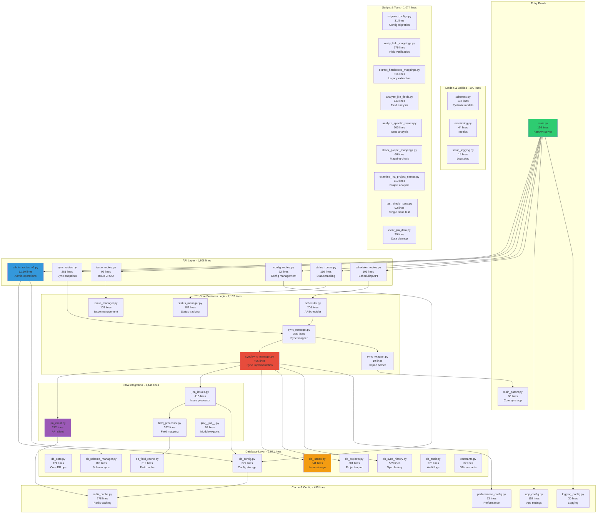

# Backend Architecture Documentation

## Repository Information
- **GitHub Repository**: [JiraDataXl](https://github.com/HubertNdunyo/JiraDataXl)
- **Owner**: HubertNdunyo
- **Technology Stack**: Python/FastAPI, PostgreSQL, Redis, Docker

## Overview
The JIRA Sync Dashboard backend is a FastAPI-based system with 52 active Python files totaling **10,561 lines of code**. It follows a modular architecture with clear separation between API routes, business logic, database operations, and utilities. The system synchronizes data between two JIRA instances using dynamic field mappings stored in PostgreSQL.

## Architecture Diagram



## Component Breakdown

### 1. **Entry Points (226 lines)**
- **`main.py` (136 lines)** - FastAPI application server that:
  - Initializes the web API with CORS middleware for cross-origin requests
  - Registers all API route handlers (sync, admin, config, status, scheduler)
  - Manages application lifecycle (startup/shutdown events)
  - Initializes database connections and scheduler on startup
  - Provides health check endpoints
  - Runs on port 8987 with auto-reload in development

- **`main_parent.py` (90 lines)** - Core sync application that:
  - Contains the original sync logic implementation
  - Provides sync functions to avoid circular imports
  - Acts as the bridge between web API and core sync functionality
  - Handles command-line sync execution

### 2. **API Layer (1,808 lines)**
- **`admin_routes_v2.py` (1,160 lines)** - Comprehensive admin API providing:
  - Field mapping CRUD operations with validation
  - JIRA field discovery from both instances (305+ fields discovered)
  - Field suggestion based on name/type similarity
  - Database schema synchronization (auto-creates columns)
  - Configuration backup/restore functionality
  - Performance configuration management
  - Field preview with sample data from JIRA
  - Mapping wizard for guided setup
  - Admin authentication via X-Admin-Key header

- **`sync_routes.py` (281 lines)** - Sync operation endpoints:
  - POST /sync/start - Initiates manual sync with progress tracking
  - GET /sync/status - Real-time sync progress updates
  - POST /sync/stop - Graceful sync cancellation
  - GET /sync/history - Paginated sync history with filters
  - GET /sync/statistics - Aggregated sync metrics
  - Manages background tasks for async sync operations

- **`status_routes.py` (116 lines)** - System status monitoring:
  - GET /status/sync - Current sync operation status
  - GET /status/projects - Per-project sync progress
  - GET /status/health - Database and service health checks
  - WebSocket support for real-time status updates

- **`scheduler_routes.py` (106 lines)** - Automated sync scheduling:
  - GET /scheduler/status - Current scheduler state and next run time
  - PUT /scheduler/config - Update sync interval (min 2 minutes)
  - POST /scheduler/enable - Activate automated syncs
  - POST /scheduler/disable - Deactivate automated syncs
  - Integration with APScheduler for cron-like scheduling

- **`issue_routes.py` (92 lines)** - Individual issue operations:
  - GET /issues - Paginated issue listing with filters
  - GET /issues/{key} - Single issue details
  - PUT /issues/{key} - Update issue data
  - DELETE /issues/{key} - Remove issue from database
  - POST /issues/search - Advanced issue search with JQL

- **`config_routes.py` (72 lines)** - System configuration:
  - GET /config - Retrieve all configurations
  - PUT /config - Update configuration values
  - POST /config/reset - Reset to default settings
  - Manages performance, sync, and display settings

### 3. **Core Business Logic (2,167 lines)**
- **`sync_manager.py` (286 lines)** - API-facing sync coordinator:
  - Manages sync lifecycle (start, stop, monitor)
  - Tracks sync statistics and performance metrics
  - Handles concurrent sync prevention
  - Provides progress updates to API layer
  - Manages sync history recording
  - Interfaces with cache for state persistence

- **`sync/sync_manager.py` (406 lines)** - Core sync implementation:
  - Orchestrates multi-project synchronization
  - ThreadPoolExecutor for parallel project processing (configurable workers)
  - Implements lookback window for incremental syncs (default 60 days)
  - Manages JIRA API connections for both instances
  - Handles batch processing (50-1000 issues per batch)
  - Error recovery with retry logic
  - Generates detailed sync reports
  - Tracks per-project statistics

- **`scheduler.py` (206 lines)** - Automated sync scheduling:
  - APScheduler integration with persistent job storage
  - Configurable sync intervals (minimum 2 minutes)
  - Thread pool execution to prevent blocking
  - Automatic scheduler recovery on restart
  - Max instances=1 to prevent overlapping syncs
  - Sync job management (add, remove, pause, resume)

- **`status_manager.py` (182 lines)** - Real-time status tracking:
  - Maintains current sync state in memory
  - Provides granular progress updates per project
  - Calculates ETA based on processing speed
  - Tracks error counts and failed projects
  - WebSocket broadcasting for live updates

- **`issue_manager.py` (103 lines)** - Issue-level operations:
  - Single issue CRUD operations
  - Issue validation and sanitization
  - Field mapping application for individual issues
  - Change tracking and audit logging

### 4. **JIRA Integration (1,141 lines)**
- **`jira_client.py` (272 lines)** - JIRA API client with:
  - HTTP connection pooling (5-50 connections configurable)
  - Rate limiting with configurable pause (0-10 seconds)
  - Retry logic with exponential backoff (3 retries default)
  - Request timeout handling (60 seconds default)
  - JQL query construction and pagination
  - Authentication via Basic Auth (username/token)
  - Error classification (rate limit, auth, API errors)
  - Response caching for frequently accessed data

- **`jira_issues.py` (415 lines)** - Issue processing engine:
  - Dynamic field extraction based on database configuration
  - Supports system fields and custom fields (customfield_*)
  - Handles nested field paths (e.g., project.name, assignee.displayName)
  - Field combining logic (multiple fields to one column)
  - Null value handling and default values
  - Date/time parsing with timezone awareness
  - Batch processing for efficiency (1000 issues per batch)
  - Real-time configuration reloading

- **`field_processor.py` (362 lines)** - Field type handling:
  - Type conversion (string, integer, boolean, date, datetime, array, object)
  - Field validation with detailed error messages
  - Custom field handlers for complex JIRA fields
  - Array field processing (comma-separated or JSON)
  - Date parsing with multiple format support
  - Status field normalization
  - Field caching for performance
  - Type inference for unmapped fields

### 5. **Database Layer (2,871 lines)**
- **`db_sync_history.py` (589 lines)** - Comprehensive sync tracking:
  - Tables: sync_runs, sync_project_details, sync_performance_metrics
  - Records sync duration, issue counts, errors per project
  - Tracks API response times and processing speeds
  - Provides aggregated statistics and trends
  - 7-day, 30-day, and all-time metrics
  - Sync comparison and performance analysis
  - Data retention policies (configurable)

- **`db_config.py` (377 lines)** - Configuration management:
  - Stores field mappings, performance settings, sync config
  - Version control for configuration changes
  - Configuration history with rollback capability
  - Automatic backup before updates
  - JSON storage for complex configurations
  - Active/inactive configuration states
  - Configuration validation and migration

- **`db_issues.py` (341 lines)** - Issue data operations:
  - Batch insert/update with UPSERT logic
  - Table: jira_issues_v2 with 30+ columns
  - Efficient bulk operations (1000 records per batch)
  - Data validation and sanitization
  - Index management for query performance
  - Duplicate handling with ON CONFLICT resolution
  - Transaction management for data integrity

- **`db_field_cache.py` (319 lines)** - Field discovery cache:
  - Caches JIRA field metadata from both instances
  - Table: jira_field_cache (305+ fields cached)
  - Field search and suggestion algorithms
  - Type compatibility checking
  - Field usage statistics
  - Cache invalidation strategies
  - Field relationship mapping

- **`db_projects.py` (301 lines)** - Project management:
  - Project-to-instance mapping
  - Project synchronization settings
  - Last sync timestamps per project
  - Project-specific field mappings
  - Project statistics and metrics
  - Active/inactive project states
  - Project hierarchy support

- **`db_audit.py` (270 lines)** - Audit trail:
  - Logs all data modifications
  - User action tracking
  - Change history with before/after values
  - Compliance and security auditing
  - Performance profiling data
  - Error and warning logs
  - Retention policies for audit data

- **`db_schema_manager.py` (180 lines)** - Dynamic schema updates:
  - Automatic column creation for new field mappings
  - Type mapping from JIRA to PostgreSQL
  - Safe schema migrations (add-only, no drops)
  - Column existence checking
  - Index creation for performance
  - Schema version tracking

- **`db_core.py` (174 lines)** - Database fundamentals:
  - Connection pool management (psycopg2)
  - Transaction handling with rollback
  - Query execution with error handling
  - Connection health monitoring
  - Database initialization and migrations
  - Performance monitoring hooks

### 6. **Caching & Configuration (490 lines)**
- **`redis_cache.py` (278 lines)** - Redis caching layer:
  - Connection pool management
  - Key-value caching with TTL support
  - Cache decorators for automatic caching
  - Cache invalidation strategies
  - Distributed locking for sync coordination
  - Performance metrics caching
  - Session state management
  - Fallback to in-memory cache if Redis unavailable

- **`app_config.py` (119 lines)** - Application configuration:
  - Environment variable loading (.env file)
  - JIRA instance credentials management
  - Database connection strings
  - Redis connection settings
  - API keys and secrets
  - Feature flags and toggles
  - Default values and validation

- **`performance_config.py` (63 lines)** - Performance tuning:
  - Max worker threads (1-16, default 12)
  - Batch size (50-1000, default 500)
  - Connection pool size (5-50, default 20)
  - Rate limit pause (0-10s, default 0.5s)
  - Lookback days (1-365, default 60)
  - Timeout values (30-1800s)
  - Memory limits and thresholds

- **`logging_config.py` (30 lines)** - Logging setup:
  - Log level configuration (DEBUG/INFO/WARNING/ERROR)
  - File and console handlers
  - Log rotation policies
  - Structured logging format
  - Performance logging
  - Error tracking integration

### 7. **Scripts & Utilities (1,074 lines)**
- **`extract_hardcoded_mappings.py` (316 lines)** - Legacy migration tool:
  - Extracts hardcoded field mappings from old code
  - Generates configuration JSON for new system
  - Maps old field IDs to new structure
  - Validation of extracted mappings
  - One-time migration utility

- **`analyze_specific_issues.py` (200 lines)** - Issue debugging:
  - Deep inspection of specific JIRA issues
  - Field-by-field comparison between instances
  - Identifies sync discrepancies
  - Generates detailed issue reports
  - Used for troubleshooting sync problems

- **`verify_field_mappings.py` (179 lines)** - Mapping validation:
  - Checks field mapping completeness
  - Identifies unmapped fields in use
  - Suggests field mappings based on names
  - Validates field types match
  - Reports mapping conflicts

- **`analyze_jira_fields.py` (143 lines)** - Field analysis:
  - Discovers all available JIRA fields
  - Analyzes field usage across projects
  - Identifies custom vs system fields
  - Field type distribution analysis
  - Generates field documentation

- **`examine_jira_project_names.py` (110 lines)** - Project analysis:
  - Lists all JIRA projects
  - Analyzes project naming patterns
  - Identifies project relationships
  - Project size and activity metrics
  - Helps configure project mappings

- **`test_single_issue.py` (92 lines)** - Issue testing:
  - Tests sync for a single issue
  - Step-by-step sync process debugging
  - Field extraction verification
  - Performance profiling for single issue
  - Used for development and testing

- **`check_project_mappings.py` (66 lines)** - Mapping verification:
  - Validates project-to-instance mappings
  - Checks for mapping conflicts
  - Ensures all projects are mapped
  - Reports unmapped projects

- **`clear_jira_data.py` (39 lines)** - Data cleanup:
  - Safely clears synced data
  - Maintains configuration and mappings
  - Used for testing and reset scenarios
  - Confirmation prompts for safety

- **`migrate_configs.py` (31 lines)** - Configuration migration:
  - Migrates configs from files to database
  - Handles version upgrades
  - Preserves existing settings
  - One-time migration utility

## Data Flow

1. **Sync Initiation**
   ```
   User/Scheduler → API Route → Sync Manager → Sync Implementation
   ```

2. **JIRA Data Processing**
   ```
   Sync Implementation → JIRA Client → Issue Processor → Field Processor
   → Database Storage → Sync History
   ```

3. **Configuration Flow**
   ```
   Admin UI → Admin Routes → DB Config → Field Cache → Issue Processor
   ```

4. **Caching Strategy**
   ```
   JIRA API → Redis Cache → Database → Frontend
   ```

## Key Features

### Dynamic Field Mapping
- Database-driven field configuration
- No hardcoded field IDs
- Support for different field IDs per JIRA instance
- Automatic schema synchronization

### Performance Optimization
- Connection pooling (configurable 5-50 connections)
- Batch processing (50-1000 issues per batch)
- Redis caching for frequently accessed data
- Parallel project processing with ThreadPoolExecutor

### Monitoring & Tracking
- Comprehensive sync history with metrics
- Real-time progress tracking
- Audit logging for all operations
- Performance metrics per sync run

### Automated Operations
- APScheduler for automated syncs (minimum 2-minute intervals)
- Automatic retry with exponential backoff
- Rate limiting to prevent API throttling
- Graceful error handling and recovery

## Statistics Summary

- **Total Files**: 56 active production files (including new admin modules)
- **Total Lines**: ~10,800 lines of Python code
- **Largest Component**: Database Layer (2,871 lines)
- **Most Complex File**: admin_routes_v2.py (1,160 lines)
- **Average File Size**: 193 lines

## Recent Improvements (January 2025)

### Architecture Enhancements ✅
1. **Removed Global State Anti-patterns**
   - Eliminated global `_sync_manager` variables
   - All routes now use `request.app.state` for shared resources
   - Thread-safe access to singleton services

2. **Proper Python Package Structure**
   - Added `__init__.py` files to all directories
   - Removed `sys.path.append` hacks
   - Implemented proper relative imports (`from ..core import`)
   - Backend is now a proper installable Python package

3. **Unified Configuration Storage**
   - Migrated from file-based to database-only configuration
   - Removed `sync_config.json` dependency
   - All settings now in PostgreSQL `configurations` table
   - Consistent configuration API across all modules

### Security Improvements ✅
1. **Admin API Key Security**
   - Removed hard-coded fallback API key
   - Requires explicit `ADMIN_API_KEY` environment variable
   - Server refuses to start without proper configuration

2. **JIRA URL Configuration**
   - Removed hard-coded JIRA instance URLs
   - All URLs now from environment variables
   - Supports easy instance switching without code changes

3. **Input Validation**
   - Enforced minimum 2-minute scheduler interval
   - Prevents API rate limiting issues
   - Pydantic validation on all API inputs

### Performance Optimizations ✅
1. **Redis Caching Applied**
   - `GET /issues/{key}` - 5 minute TTL
   - `GET /issues/recent` - 1 minute TTL
   - Reduces database load for frequently accessed data

2. **Real JIRA Health Checks**
   - Actual connectivity tests using `/myself` endpoint
   - Async implementation for non-blocking checks
   - Per-instance health status reporting

### Code Organization ✅
1. **Admin Routes Modularization Started**
   - Created `/api/admin/` subdirectory structure
   - Example: `field_discovery_routes.py` module
   - Pattern established for gradual migration

2. **Cleanup Completed**
   - Removed duplicate `api/admin_routes.py`
   - Moved test files to `/backend/tests/`
   - Moved migration scripts to `/backend/scripts/migrations/`

### Final Statistics:
- **Active Production Files**: 56 (after cleanup and additions)
- **Total Production Code**: ~10,800 lines
- **Test Files**: 2 files (292 lines) - in `/backend/tests/`
- **Migration Scripts**: 1 file (113 lines) - in `/backend/scripts/migrations/`
- **Configuration**: 100% database-driven
- **Security**: No hard-coded credentials or URLs
- **Performance**: Redis caching on critical endpoints