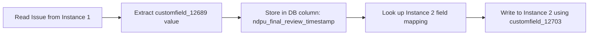

# JIRA Sync Architecture Documentation

## Table of Contents
1. [Overview](#overview)
2. [Core Concepts](#core-concepts)
3. [Field Mapping Architecture](#field-mapping-architecture)
4. [Sync Logic Flow](#sync-logic-flow)
5. [Database Design](#database-design)
6. [Examples](#examples)
7. [Technical Implementation](#technical-implementation)

## Overview

This document explains the architectural design of the JIRA synchronization system, focusing on how field mappings enable bidirectional data flow between two JIRA instances while maintaining data integrity and consistency.

## Core Concepts

### The Three-Layer Architecture

```
┌─────────────────┐     ┌──────────────┐     ┌─────────────────┐
│ JIRA Instance 1 │ ←→  │   Database   │ ←→  │ JIRA Instance 2 │
│  (Source/Target)│     │ (Single Truth)│     │ (Source/Target) │
└─────────────────┘     └──────────────┘     └─────────────────┘
```

### Key Principles

1. **Single Source of Truth**: Each business concept has ONE database column
2. **Field ID Translation**: Custom field IDs are instance-specific identifiers
3. **Bidirectional Sync**: Data can flow in either direction
4. **Mapping as Configuration**: Field relationships are configuration, not code

## Field Mapping Architecture

### The Problem

JIRA assigns different custom field IDs to the same conceptual field across instances:

| Business Concept | Instance 1 ID | Instance 2 ID |
|-----------------|---------------|---------------|
| NDPU Final Review Timestamp | customfield_12689 | customfield_12703 |
| NDPU Order Number | customfield_10501 | customfield_10502 |
| NDPE Editor Name | customfield_11500 | customfield_11501 |

### The Solution

Field mappings create a translation layer:

```json
{
  "ndpu_final_review_timestamp": {
    "type": "datetime",
    "description": "NDPU Final Review Timestamp",
    "instance_1": {
      "field_id": "customfield_12689",
      "name": "NDPU Final Review Timestamp"
    },
    "instance_2": {
      "field_id": "customfield_12703",
      "name": "NDPU Final Review Timestamp"
    }
  }
}
```

### Database Column Strategy

**One Column Per Business Concept**:
- Column name: Normalized field name (e.g., `ndpu_final_review_timestamp`)
- Stores the actual value regardless of source instance
- Enables consistent reporting and querying

## Sync Logic Flow

### Instance 1 → Instance 2 Sync



#### Step-by-Step Process:

1. **Fetch Issue from Instance 1**
   ```python
   issue = jira1.get_issue("PROJ-123")
   raw_value = issue.fields.customfield_12689  # "2024-01-15T10:30:00"
   ```

2. **Map to Database Column**
   ```python
   # Mapping tells us: customfield_12689 → ndpu_final_review_timestamp
   db_column = field_mapping.get_db_column("customfield_12689", "instance_1")
   ```

3. **Store in Database**
   ```sql
   UPDATE synced_issues 
   SET ndpu_final_review_timestamp = '2024-01-15T10:30:00'
   WHERE issue_key = 'PROJ-123'
   ```

4. **Prepare for Instance 2**
   ```python
   # Mapping tells us: ndpu_final_review_timestamp → customfield_12703
   instance2_field = field_mapping.get_field_id("ndpu_final_review_timestamp", "instance_2")
   ```

5. **Create/Update in Instance 2**
   ```python
   update_data = {
     "fields": {
       "customfield_12703": "2024-01-15T10:30:00"
     }
   }
   jira2.update_issue("PROJ-456", update_data)
   ```

### Instance 2 → Instance 1 Sync (Reverse)

The same process works in reverse:
- Read `customfield_12703` from Instance 2
- Store in same `ndpu_final_review_timestamp` column
- Write to Instance 1 using `customfield_12689`

## Database Design

### Issues Table Structure

```sql
CREATE TABLE synced_issues (
    id SERIAL PRIMARY KEY,
    issue_key_instance_1 VARCHAR(50),
    issue_key_instance_2 VARCHAR(50),
    
    -- Standard JIRA fields
    summary TEXT,
    description TEXT,
    status VARCHAR(50),
    
    -- Custom fields (one column per business concept)
    ndpu_final_review_timestamp TIMESTAMP,
    ndpu_order_number VARCHAR(100),
    ndpe_editor_name VARCHAR(255),
    ndpu_client_email VARCHAR(255),
    -- ... more custom fields
    
    -- Sync metadata
    last_synced_from_instance_1 TIMESTAMP,
    last_synced_from_instance_2 TIMESTAMP,
    sync_status VARCHAR(50),
    
    created_at TIMESTAMP DEFAULT NOW(),
    updated_at TIMESTAMP DEFAULT NOW()
);
```

### Key Design Decisions

1. **Column Naming**: Based on normalized field names, not JIRA IDs
2. **Data Types**: Match the business data type, not JIRA's representation
3. **No Duplicate Columns**: One column serves both instances
4. **Sync Tracking**: Metadata columns track sync state

## Examples

### Example 1: Multi-Field Issue Sync

**Source Issue (Instance 1)**:
```json
{
  "key": "PHOTO-789",
  "fields": {
    "summary": "Wedding Photography Order",
    "customfield_10501": "ORD-2024-0145",  // Order Number
    "customfield_12689": "2024-01-15T10:30:00",  // Review Timestamp
    "customfield_11500": "John Smith"  // Editor Name
  }
}
```

**Database Storage**:
```sql
INSERT INTO synced_issues (
    issue_key_instance_1,
    summary,
    ndpu_order_number,
    ndpu_final_review_timestamp,
    ndpe_editor_name
) VALUES (
    'PHOTO-789',
    'Wedding Photography Order',
    'ORD-2024-0145',
    '2024-01-15 10:30:00',
    'John Smith'
);
```

**Target Issue (Instance 2)**:
```json
{
  "key": "EDIT-456",
  "fields": {
    "summary": "Wedding Photography Order",
    "customfield_10502": "ORD-2024-0145",  // Different ID, same value
    "customfield_12703": "2024-01-15T10:30:00",  // Different ID, same value
    "customfield_11501": "John Smith"  // Different ID, same value
  }
}
```

### Example 2: Partial Field Update

When only some fields are updated:

```python
# Instance 1 updates only the editor name
update = {
    "customfield_11500": "Jane Doe"  # New editor assigned
}

# Sync process:
# 1. Update database column
UPDATE synced_issues SET ndpe_editor_name = 'Jane Doe' WHERE issue_key_instance_1 = 'PHOTO-789'

# 2. Push to Instance 2 with correct field ID
jira2.update_issue("EDIT-456", {
    "fields": {
        "customfield_11501": "Jane Doe"  # Instance 2's field ID
    }
})
```

## Technical Implementation

### Field Mapping Service

```python
class FieldMappingService:
    def __init__(self, config):
        self.mappings = config['field_groups']['Wizard Fields']['fields']
    
    def get_db_column(self, field_id: str, instance: str) -> str:
        """Get database column name for a JIRA field ID"""
        for db_column, mapping in self.mappings.items():
            if instance == "instance_1" and mapping['instance_1']:
                if mapping['instance_1']['field_id'] == field_id:
                    return db_column
            elif instance == "instance_2" and mapping['instance_2']:
                if mapping['instance_2']['field_id'] == field_id:
                    return db_column
        return None
    
    def get_field_id(self, db_column: str, instance: str) -> str:
        """Get JIRA field ID for a database column"""
        mapping = self.mappings.get(db_column)
        if mapping:
            instance_mapping = mapping.get(instance)
            if instance_mapping:
                return instance_mapping['field_id']
        return None
```

### Sync Manager

```python
class SyncManager:
    def sync_issue(self, issue_key: str, source_instance: str):
        # 1. Fetch issue from source
        issue_data = self.fetch_issue(issue_key, source_instance)
        
        # 2. Transform to database format
        db_record = {}
        for jira_field_id, value in issue_data['fields'].items():
            db_column = self.field_mapper.get_db_column(
                jira_field_id, 
                source_instance
            )
            if db_column:
                db_record[db_column] = value
        
        # 3. Save to database
        self.save_to_database(db_record)
        
        # 4. Sync to target instance
        target_instance = self.get_target_instance(source_instance)
        target_fields = {}
        
        for db_column, value in db_record.items():
            target_field_id = self.field_mapper.get_field_id(
                db_column, 
                target_instance
            )
            if target_field_id:
                target_fields[target_field_id] = value
        
        # 5. Create/update in target
        self.update_target_issue(target_fields, target_instance)
```

## Benefits of This Architecture

1. **Maintainability**: Field mappings are configuration, not code
2. **Flexibility**: Easy to add new field mappings without code changes
3. **Data Integrity**: Single source of truth in database
4. **Performance**: Efficient queries on normalized columns
5. **Debugging**: Clear data flow and transformation points
6. **Scalability**: Can extend to more instances if needed

## Common Pitfalls to Avoid

1. **Don't create duplicate columns** for the same field in different instances
2. **Don't hardcode field IDs** in sync logic
3. **Don't assume field IDs are consistent** across instances
4. **Always validate field types** match between instances
5. **Handle missing fields gracefully** (field might not exist in target)

## Future Enhancements

1. **Field Value Transformation**: Support for value mapping (e.g., status names)
2. **Conditional Sync**: Rules for when to sync certain fields
3. **Conflict Resolution**: Handling concurrent updates
4. **Audit Trail**: Detailed history of all field changes
5. **Field Validation**: Type checking and business rule validation

---

*Last Updated: 2025-01-08*
*Version: 1.0*